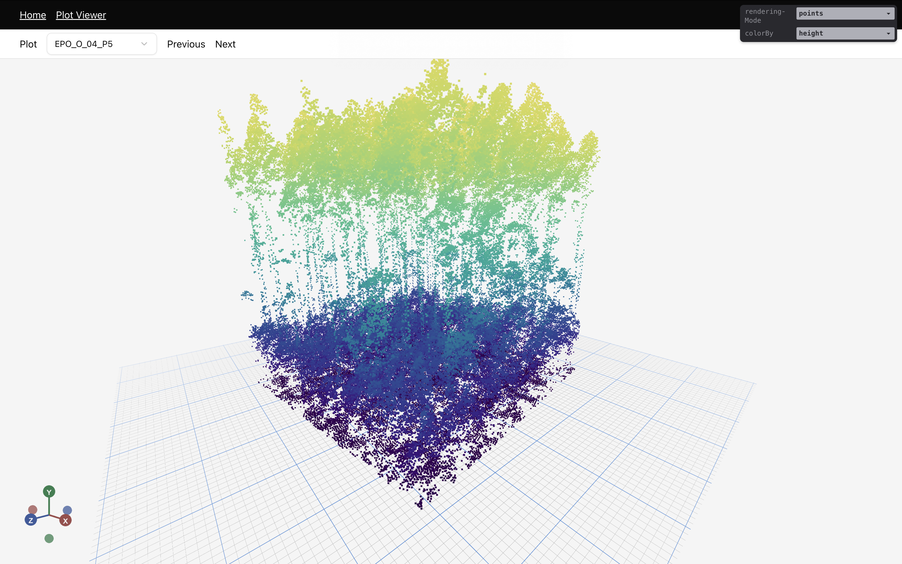
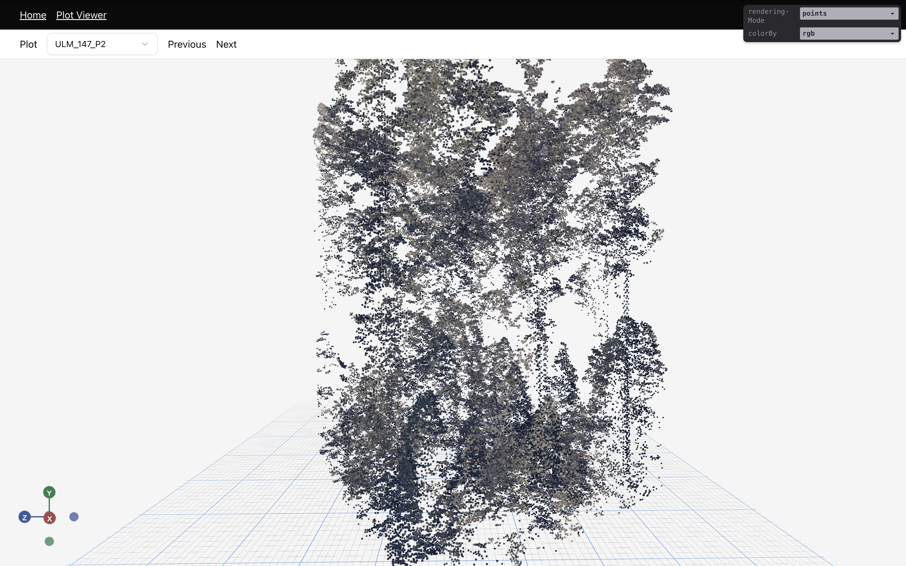

# Thesis Visualiser

This web application was build as part of my Masters of Environmental Geospatial Science at the University of Tasmania.
It's main feature is the visualisation of height-normalised point clouds stored as cloud optimised point clouds [(COPC)](https://copc.io/). There were previously some other visualisaitons but they have been removed.
This tool is using [Copc.js](https://github.com/connormanning/copc.js/) for reading COPC files and [Three.js](https://threejs.org/) for the visualisation. This code is presented as a Proof of Concept. There is not intention to maintain or support it.

